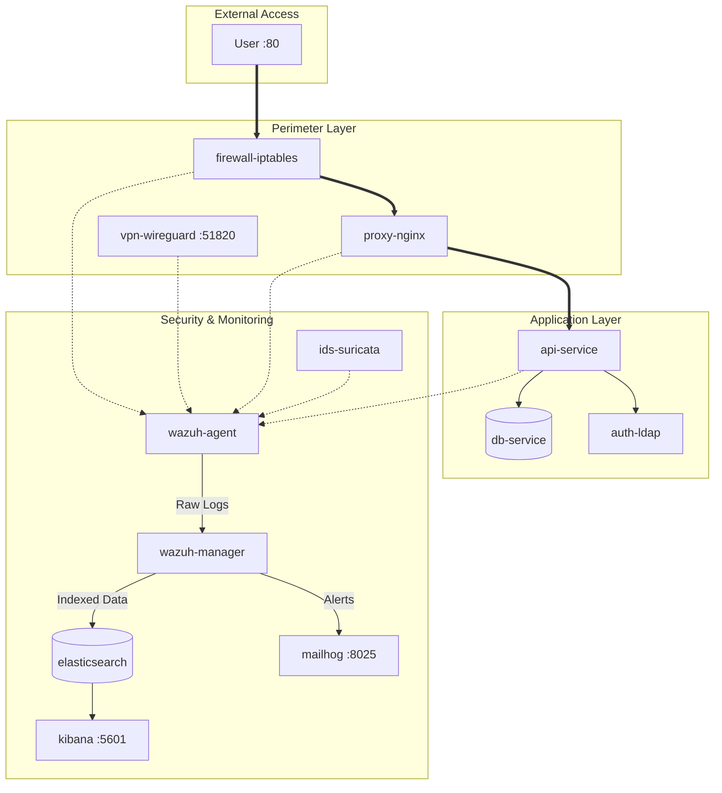

# 🛡️ SafePay SOC Project

> **Enterprise-Grade Security Operations Center Prototype** for a mid-sized FinTech organization

A containerized security monitoring environment demonstrating log collection, correlation, threat detection, and automated alerting using industry-standard tools.

---

## 📋 Executive Summary

| Metric | Value |
|--------|-------|
| **Containers** | 13 services |
| **Detection Rules** | 10 custom rules |
| **Coverage** | App, Network, VPN, Firewall |
| **Validation** | `make test-all` (automated) |

---

## 🏗️ Architecture



---

## 🛠️ Technology Stack

| Layer | Technology | Purpose |
|-------|------------|---------|
| **Containerization** | Docker + Compose | 13-service orchestration |
| **Backend** | FastAPI (Python 3.13) | REST API with security logging |
| **Reverse Proxy** | Nginx | TLS termination, JSON access logs |
| **Database** | PostgreSQL 15 | Transaction data |
| **Identity** | OpenLDAP | Centralized authentication |
| **IDS** | Suricata | Network intrusion detection |
| **SIEM** | Wazuh | Event correlation & alerts |
| **Log Shipper** | Filebeat | Log collection → Elasticsearch |
| **VPN** | WireGuard | Remote access with auth logging |
| **Firewall** | iptables | Perimeter blocking with logging |
| **Notifications** | MailHog | Email alert capture |

---

## 🚀 Quick Start

```bash
# 1. Clone & configure
git clone <repository-url>
cd soc-project
cp .env.example .env

# 2. Set your network interface in .env
# Run: ip link show (use e.g., enp12s0, eth0)

# 3. Start all services
docker-compose up -d

# 4. Verify operational status
make preflight

# 5. Run detection tests
make test-all
```

### Access Points

| Service | URL |
|---------|-----|
| **API** | http://localhost |
| **Kibana** | http://localhost:5601 |
| **MailHog** | http://localhost:8025 |

---

## 🎯 Detection Rules (Tuned for SOC Maturity)

### Severity Balancing

| Rule | Description | Level | Trigger |
|------|-------------|-------|---------|
| 100002 | Login Success | 3 | Single event |
| 100003 | Login Failed | 3 | Single event |
| 100004 | **Brute Force** | 12 | 5 failures/60s |
| 100005 | **SQL Injection** | 12 | Payload match |
| 100006 | API Error 500 | 7 | Server error |
| 100010 | **Privilege Escalation** | 10 | Admin override |
| 100020 | VPN Auth Fail | 4 | Single event |
| 100021 | **VPN Brute Force** | 10 | 5 failures/60s |
| 100030 | Firewall Drop | 3 | Single event |
| 100031 | **Port Scan** | 10 | 15 drops/60s |

> **Design Principle:** Single events = Low severity. Correlated patterns = High severity.

---

## 🧪 Automated Testing

### One-Command Validation

```bash
make test-all    # Run ALL detection tests
```

### Individual Tests

| Test | Command | Rule Verified |
|------|---------|---------------|
| Privilege Escalation | `make test-privilege` | 100010 |
| SQL Injection | `make test-sqli` | 100005 |
| Brute Force | `make brute-force` | 100004 |
| Firewall Block | `make test-fw-block` | 100030 |
| VPN Noise | `make test-vpn` | 100020 |
| Kill Chain | `make test-killchain` | Multiple |

### Detection Assertion

All critical tests include **automatic verification** via Elasticsearch:
- ✅ Attack executed
- ✅ Alert indexed in ES
- ✅ Rule ID confirmed

---

## 📁 Project Structure

```
soc-project/
├── docker-compose.yml       # 13-service orchestration
├── Makefile                 # Automated testing & ops
├── State.md                 # Current project status
├── backend-fastapi/         # FastAPI with security logging
├── nginx/                   # Reverse proxy config
├── suricata/                # IDS configuration & rules
├── wazuh/                   # SIEM custom rules (100xxx)
├── firewall/                # iptables logging scripts
├── config/                  # Agent configurations
├── logs/                    # Centralized logs (git-ignored)
└── docs/                    # Documentation (see below)
```

> 📖 For detailed structure explanation, see [docs/tree.md](docs/tree.md)

---

## 📊 Log Sources

| Source | Format | Location |
|--------|--------|----------|
| FastAPI | JSON | `logs/api/security.json` |
| Nginx | JSON | `logs/nginx/access.log` |
| Suricata | EVE JSON | `logs/suricata/eve.jsonl` |
| Firewall | journald | `journalctl -k` (host) |

> ⚠️ Firewall logs use journald on Fedora. See [docs/limitations.md](docs/limitations.md) for container constraints.

---

## 🔧 Troubleshooting

```bash
# Check container status
make status

# Verify SIEM pipeline
make siem-ready

# View Wazuh alerts
make view-alerts

# Check MailHog for notifications
curl http://localhost:8025/api/v2/messages | jq '.count'
```

---

## 📚 Documentation

| Document | Description |
|----------|-------------|
| [docs/tree.md](docs/tree.md) | Project structure overview |
| [docs/tests.md](docs/tests.md) | Detection validation methodology |
| [docs/test-results.md](docs/test-results.md) | Latest automated test results |
| [docs/vulnerabilities.md](docs/vulnerabilities.md) | Intentional vulnerable surfaces |
| [docs/limitations.md](docs/limitations.md) | Architectural constraints |
| [docs/debug.md](docs/debug.md) | Troubleshooting guide |

---

## 📖 References

- [NIST SP 800-92](https://csrc.nist.gov/publications/detail/sp/800-92/final) - Log Management
- [NIST SP 800-61r2](https://csrc.nist.gov/publications/detail/sp/800-61/rev-2/final) - Incident Handling
- [MITRE ATT&CK](https://attack.mitre.org/) - Threat Framework
- [OWASP Top 10](https://owasp.org/Top10/) - Web Security Risks

---

## 📝 License

Educational project for Security Operations Center coursework.
